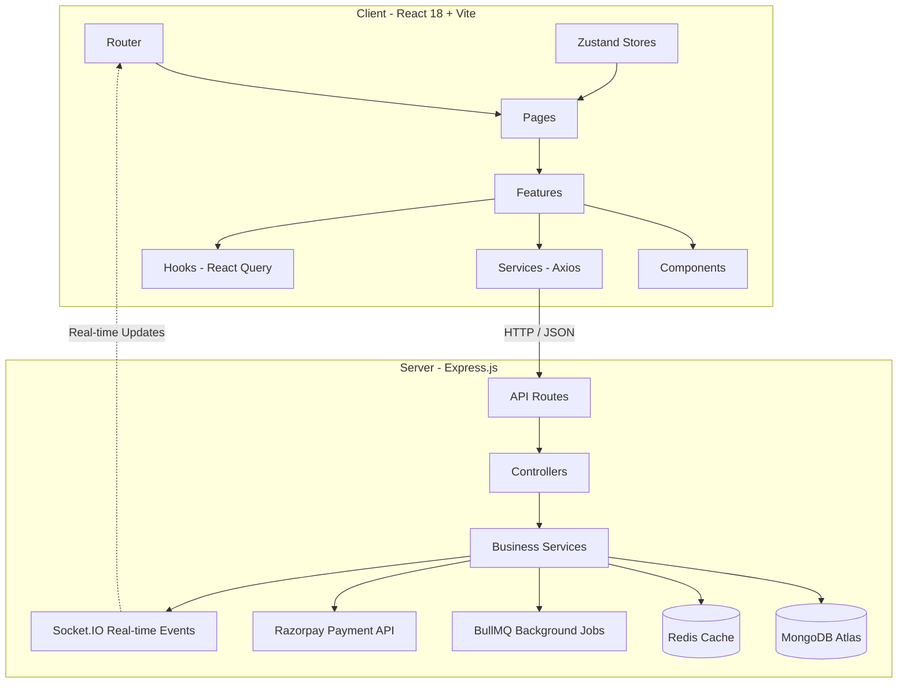

# Velvet Bytes — Codebase Analysis & Frontend Page Design

This document details the analysis of the Velvet Bytes backend modules and defines the required frontend pages, including their inputs, outputs, and behaviors.

---

## 1. System Architecture Overview

Velvet Bytes is a multi-role, outlet-centric burger ordering platform built as a Modular Monolith.

### Key Technical Patterns
*   **Authentication**: Password hashing with `bcrypt`. JWT-based authentication using Access Tokens (delivered via headers/JSON) and Refresh Tokens (delivered via HTTP-only cookies).
*   **Request Validation**: Strict request schema validation via **Zod** middleware on the backend.
*   **Caching**: Redis is used for key-value caching (e.g., individual products, listing pages, popular products, user profile, rate limiting, and brute-force prevention).
*   **Asynchronous Processing**: **BullMQ** with Redis is used to queue and process orders asynchronously (`order.worker.js`).
*   **Real-time Communication**: **Socket.IO** is used for real-time notifications, specifically for live order tracking status updates (transitions from `PLACED` -> `ACCEPTED` -> `PREPARING` -> `READY` -> `DELIVERED`).

---

## 2. Core Entities & Database Models

To understand the inputs and outputs, here is the schema summary of the MongoDB collections defined in the server code:

| Model | Collection | Key Fields | Description |
| :--- | :--- | :--- | :--- |
| **User** | `users` | `name`, `email`, `role` (CUSTOMER/OUTLET_MANAGER/ADMIN), `phone`, `savedAddresses` (array), `favouriteProductIds` (array of Product IDs), `isActive`, `suspendedAt`, `outletId` (for managers) | Holds credentials, roles, saved delivery addresses, and customer profiles. |
| **Product** | `products` | `outletId`, `name`, `description`, `category` (BURGER/SIDE/BEVERAGE/DESSERT), `imageUrl`, `price`, `stock`, `isAvailable`, `ratings` (`avg`, `count`) | The menu items associated with specific outlets. Includes inventory stock controls and rating aggregations. |
| **Offer** | `offers` | `outletId`, `code`, `type` (FLAT/PERCENT/BOGO), `value`, `minOrderValue`, `expiryDate`, `usageLimit`, `usedCount`, `maxDiscount` | Coupon codes and discounts specific to outlets. |
| **Review** | `reviews` | `userId`, `productId`, `orderId`, `rating` (1-5), `comment` | Customer-submitted product feedback, restricted to one review per product per order. |
| **Order** | `orders` | `userId`, `outletId`, `items` (embedded array of items with name, price, qty), `totalAmount`, `tax`, `discount`, `paymentMode` (UPI/CARD/NETBANKING/COD), `orderStatus`, `paymentStatus`, `razorpayOrderId`, `address` | Transactions capturing purchased items, delivery address, status workflow, and payment data. |
| **Cart** | `carts` | `userId`, `outletId`, `items` (array of `productId` and `qty`) | Active shopping carts. Auto-deleted after 7 days of inactivity (via MongoDB TTL index). |
| **Outlet** | `outlets` | `name`, `ownerId` (User ID), `isApproved`, `isActive`, `suspendedAt`, `deletedAt` | Individual burger joints. |

---

## 3. Frontend Pages: Route & Interface Design

Below is the complete inventory of the frontend pages required for the project, categorized by user role.

### Category 3.1: Public & Authentication Pages
These pages are accessible by anyone (or restricted to unauthenticated users).

#### 1. Login Page
*   **Route**: `/login`
*   **Role**: Unauthenticated (redirects to home/dashboard if already logged in).
*   **Purpose**: Authenticate users (Customers, Outlet Managers, Admins) and route them to their respective starting views.
*   **Inputs (from User/UI)**:
    *   `email` (Text field, validated string)
    *   `password` (Password field, string)
*   **Outputs & Expected Results**:
    *   *API Request*: `POST /api/auth/login` containing `email` and `password`.
    *   *Successful Response*: JSON containing user details (`role`, `name`, `id`) and Access Token. Set cookie for Refresh Token. Store user role and profile in Zustands `authStore`.
    *   *Action*: Redirect to:
        *   `/` (Home) for `CUSTOMER`
        *   `/manager/dashboard` for `OUTLET_MANAGER`
        *   `/admin/dashboard` for `ADMIN`
    *   *Failure Response*: Validation errors or invalid credentials toast display.

#### 2. Sign-Up Page
*   **Route**: `/signup`
*   **Role**: Unauthenticated.
*   **Purpose**: Enable new Customers to register accounts.
*   **Inputs (from User/UI)**:
    *   `name` (Text field, string)
    *   `email` (Text field, valid email format)
    *   `phone` (Text field, optional phone number format)
    *   `password` (Password field, string matching security requirements)
*   **Outputs & Expected Results**:
    *   *API Request*: `POST /api/auth/signup` containing profile data.
    *   *Successful Response*: User account created message. Sets tokens and triggers direct login.
    *   *Action*: Automatically logs user in and redirects to customer home `/`.

---

### Category 3.2: Customer Pages
These pages form the customer-facing e-commerce storefront.

#### 3. Home / Product Browsing Page
*   **Route**: `/`
*   **Role**: `CUSTOMER` / Anonymous Browser.
*   **Purpose**: Explore outlets, filter products by category/outlet, search products, and display featured items.
*   **Inputs (from User/UI)**:
    *   `search` (Search query string input)
    *   `category` (Filter select: `BURGER`, `SIDE`, `BEVERAGE`, `DESSERT`)
    *   `outletId` (Select list/dropdown to choose which outlet to view products from)
    *   `sortBy` (Sort selections: price ascending/descending, ratings)
    *   `page` / pagination controls
*   **Outputs & Expected Results**:
    *   *API Request*: `GET /api/products` with query params (`search`, `category`, `outletId`, `limit`).
    *   *API Request*: `GET /api/products/popular` (to display popular items in a carousel).
    *   *Displayed Data*: Product cards displaying image, name, price, rating, availability status, and add-to-cart shortcuts.
    *   *Action*: Clicking a product navigates to `/product/:id`. Clicking "Add to Cart" triggers `POST /api/cart/add`.

#### 4. Product Detail Page
*   **Route**: `/product/:id`
*   **Role**: `CUSTOMER` / Anonymous Browser.
*   **Purpose**: View detailed specifications, ingredient description, reviews, rating count, and active offers for a specific product.
*   **Inputs (from User/UI)**:
    *   `productId` (Implicitly from URL parameter `:id`)
    *   `quantity` (Number spinner, defaults to 1)
    *   `reviewRating` (Star selector 1-5, for submitting a review)
    *   `reviewComment` (Text area, up to 500 characters)
*   **Outputs & Expected Results**:
    *   *API Request*: `GET /api/products/:id` (Returns product schema details, reviews, average rating).
    *   *API Request (Protected)*: `POST /api/products/:productId/reviews` (Submit new review).
    *   *Action*: Adding to cart triggers `POST /api/cart/add` updating Zustand `cartStore`. Toggling favourite calls `POST /api/auth/profile/favourites/toggle`.

#### 5. Shopping Cart Page
*   **Route**: `/cart`
*   **Role**: `CUSTOMER` (Authorized).
*   **Purpose**: Manage items added to cart, adjust quantities, input discount coupon, and see order cost breakdown.
*   **Inputs (from User/UI)**:
    *   Quantity changes (plus/minus buttons)
    *   Item deletion (trash bin button)
    *   `couponCode` (Text input field for applying outlet promo offer)
*   **Outputs & Expected Results**:
    *   *API Request*: `GET /api/cart` (Retrieve cart items, prices, associated outlet).
    *   *API Request*: `DELETE /api/cart/item/:id` (Remove product item).
    *   *API Request*: `POST /api/cart/add` (Increment/decrement quantity).
    *   *API Request*: `POST /api/products/offers/validate` (Validate and apply coupon code).
    *   *Displayed Data*: Summary of list items, unit and subtotal prices, coupon savings (if valid), and final total. Button to proceed to checkout.

#### 6. Checkout Page
*   **Route**: `/checkout`
*   **Role**: `CUSTOMER` (Authorized).
*   **Purpose**: Select a delivery address, provide custom delivery notes, select payment method, and complete the payment process.
*   **Inputs (from User/UI)**:
    *   `addressId` (Radio selector among saved addresses, or button to create a new address)
    *   `instructions` (Text area for delivery notes)
    *   `paymentMode` (Radio selector: `UPI`, `CARD`, `NETBANKING`, `COD`)
*   **Outputs & Expected Results**:
    *   *API Request*: `GET /api/auth/me` (Retrieve user's saved addresses).
    *   *API Request*: `POST /api/orders` (Send `outletId`, `items`, `paymentMode`, `address`, and `instructions`).
    *   *Successful Response*:
        *   If `COD`: Redirect immediately to Order Success Page `/order/:id/track`.
        *   If Online (`UPI`, `CARD`, `NETBANKING`): Returns a `razorpayOrderId` and amount. Trigger Razorpay Checkout overlay.
    *   *Payment Gate Interaction (Online)*: User completes payment on Razorpay. Razorpay returns `razorpay_payment_id`, `razorpay_order_id`, `razorpay_signature`.
    *   *API Request*: `POST /api/orders/:id/payment/verify` (Verify Razorpay signature).
    *   *Action*: Upon successful verification, clear client cart store and route to `/order/:id/track`.

#### 7. Order Tracking & History Page
*   **Route**: `/orders` (History) and `/order/:id/track` (Real-time tracker)
*   **Role**: `CUSTOMER` (Authorized).
*   **Purpose**: View past order history and track the current stage of an active order in real time.
*   **Inputs (from User/UI)**:
    *   `orderId` (Parameter in URL `/order/:id/track`)
*   **Outputs & Expected Results**:
    *   *API Request*: `GET /api/orders` (Fetch list of all past orders).
    *   *API Request*: `GET /api/orders/:id` (Fetch details of the specific order).
    *   *Socket Connection*: Connect to Socket.IO namespace. Listen to order status updates for `orderId`.
    *   *Real-time Updates*: UI updates step-tracker (e.g. "Placed" -> "Accepted" -> "Preparing" -> "Ready" -> "Delivered") immediately when backend broadcasts changes.

#### 8. Customer Profile Page
*   **Route**: `/profile`
*   **Role**: `CUSTOMER` (Authorized).
*   **Purpose**: Manage account parameters: update profile details, manage saved delivery addresses, change password, and view favourite items.
*   **Inputs (from User/UI)**:
    *   Profile fields: `name`, `phone`
    *   Password fields: `currentPassword`, `newPassword`
    *   Address form: `label` (e.g., Home, Office), `street`, `city`, `state`, `zipCode`
*   **Outputs & Expected Results**:
    *   *API Request*: `PUT /api/auth/profile` (Update name/phone).
    *   *API Request*: `PUT /api/auth/password` (Modify password).
    *   *API Request*: `POST /api/auth/profile/addresses` (Add new address).
    *   *API Request*: `DELETE /api/auth/profile/addresses/:addressId` (Remove address).
    *   *API Request*: `PATCH /api/auth/profile/addresses/:addressId/default` (Mark default).
    *   *Displayed Data*: Success toasts, list of updated saved addresses, list of favourited products.

---

### Category 3.3: Outlet Manager Pages
These pages provide outlet inventory, offer, and fulfillment tools.

#### 9. Manager Dashboard / Analytics Page
*   **Route**: `/manager/dashboard`
*   **Role**: `OUTLET_MANAGER` (Authorized).
*   **Purpose**: Central hub showing outlet sales statistics, order volume, recent orders, and outlet configuration options.
*   **Inputs (from User/UI)**:
    *   `timeframe` (Filter selector: Today, Last 7 Days, This Month)
*   **Outputs & Expected Results**:
    *   *API Request*: `GET /api/orders` with outlet filters.
    *   *Displayed Data*: Stat blocks (Total Revenue, Orders Completed, Active Orders, Average Order value), trend graphs, list of active orders awaiting preparation.

#### 10. Product Inventory & Menu Management Page
*   **Route**: `/manager/inventory`
*   **Role**: `OUTLET_MANAGER` (Authorized).
*   **Purpose**: CRUD products of the manager's outlet. Create new burgers/sides, update pricing, upload images, adjust stock counts, or toggle availability.
*   **Inputs (from User/UI)**:
    *   Product form: `name`, `description`, `price`, `category`, `stock`, `isAvailable` (Checkbox)
    *   `image` (File upload input selector)
*   **Outputs & Expected Results**:
    *   *API Request*: `POST /api/products` (Create product with `FormData` multipart image).
    *   *API Request*: `PUT /api/products/:id` (Update product details).
    *   *API Request*: `DELETE /api/products/:id` (Soft delete product by setting `isActive`/`isAvailable` to false).
    *   *Displayed Data*: Data-table listing all outlet products with quick toggles for stock and availability.

#### 11. Coupon & Offer Management Page
*   **Route**: `/manager/offers`
*   **Role**: `OUTLET_MANAGER` (Authorized).
*   **Purpose**: Manage promotional codes and BOGO offers specific to the outlet.
*   **Inputs (from User/UI)**:
    *   Offer form: `code` (string), `type` (`FLAT`, `PERCENT`, `BOGO`), `value`, `minOrderValue`, `expiryDate` (Date picker), `usageLimit`
*   **Outputs & Expected Results**:
    *   *API Request*: `POST /api/products/offers` (Create promotional coupon).
    *   *Displayed Data*: List of current promotions, indicating remaining uses, status (active/expired), and discount structures.

#### 12. Outlet Orders Fulfillment Page
*   **Route**: `/manager/orders`
*   **Role**: `OUTLET_MANAGER` (Authorized).
*   **Purpose**: Track and update order fulfillment stages.
*   **Inputs (from User/UI)**:
    *   Order Status actions: "Accept Order" (moves from `PLACED` -> `ACCEPTED`), "Start Preparing" (moves to `PREPARING`), "Ready for Dispatch" (moves to `READY`), "Mark Delivered" (moves to `DELIVERED`), "Cancel Order" (moves to `CANCELLED`).
*   **Outputs & Expected Results**:
    *   *API Request*: `PATCH /api/orders/:id/status` containing `orderStatus`.
    *   *Successful Response*: Socket.IO event emitted to customer client updating them on status progress in real-time.
    *   *Displayed Data*: Grouped lists of orders by stage: "Pending", "Preparing", "Ready", "Completed".

---

### Category 3.4: Admin Pages
These pages host administrative oversight modules.

#### 13. Admin Dashboard & Platform Analytics Page
*   **Route**: `/admin/dashboard`
*   **Role**: `ADMIN` (Authorized).
*   **Purpose**: High-level platform statistics (total platform revenue, order distributions, active registered outlets).
*   **Inputs (from User/UI)**: None (automatic metrics loading).
*   **Outputs & Expected Results**:
    *   *API Request*: `GET /api/admin/analytics` (Platform-wide summaries).
    *   *Displayed Data*: Stat grids (Overall Gross Merchandise Value, Registered Outlets, Active Users count, Top Performing Outlets).

#### 14. User & Account Management Page
*   **Route**: `/admin/users`
*   **Role**: `ADMIN` (Authorized).
*   **Purpose**: Oversight of registered users. Admin can suspend users, delete users, or view customer activity profiles.
*   **Inputs (from User/UI)**:
    *   Search terms (by email or name)
    *   Role filters (`CUSTOMER`, `OUTLET_MANAGER`, `ADMIN`)
    *   `suspensionReason` (Text input modal when suspending a user)
*   **Outputs & Expected Results**:
    *   *API Request*: `GET /api/admin/users` (List users with search/filter query strings).
    *   *API Request*: `PATCH /api/admin/users/:id/suspend` (Suspend user).
    *   *API Request*: `DELETE /api/admin/users/:id` (Delete user).
    *   *Displayed Data*: Paginated user tables displaying registration status and activity states.

#### 15. Outlet Approvals & Moderation Page
*   **Route**: `/admin/outlets`
*   **Role**: `ADMIN` (Authorized).
*   **Purpose**: Approve newly created outlet registrations or suspend outlets violating platform rules.
*   **Inputs (from User/UI)**:
    *   Approval actions (Approve / Reject / Suspend button clicks)
*   **Outputs & Expected Results**:
    *   *API Request*: `GET /api/admin/outlets` (Get list of outlets on the platform).
    *   *API Request*: `PATCH /api/admin/outlets/:id/approve` (Approve outlet, enabling its products to appear on storefront).
    *   *API Request*: `PATCH /api/admin/outlets/:id/suspend` (Suspend outlet).

#### 16. System Audit Logs Page
*   **Route**: `/admin/audit-logs`
*   **Role**: `ADMIN` (Authorized).
*   **Purpose**: Review immutable activity audit trails detailing administrative, managerial, and transaction events.
*   **Inputs (from User/UI)**:
    *   Filters: `userId`, `action` type (e.g., SUSPEND_USER, APPROVE_OUTLET, CREATE_PRODUCT), Date ranges
*   **Outputs & Expected Results**:
    *   *API Request*: `GET /api/admin/audit-logs` (Fetch audit schemas).
    *   *Displayed Data*: Detailed tabular logs showing Time, Performed By, Affected Target, Action Type, and IP Address.

---

## 4. Summary of Expected Pages

The Velvet Bytes platform requires **16 distinct frontend pages**:

*   **Public/Auth (2 Pages)**: Login, Sign-Up
*   **Customer Storefront (6 Pages)**: Home/Browse, Product Detail, Shopping Cart, Checkout, Order Tracker/History, Profile
*   **Outlet Manager Dashboard (4 Pages)**: Analytics Dashboard, Product Inventory, Coupon Management, Orders Fulfillment
*   **Admin Console (4 Pages)**: Platform Analytics, User Management, Outlet Approvals, System Audit Logs

These pages can share global layouts (e.g., standard Customer header with cart indicator, Admin/Manager sidebars with collapsible analytics views) and component primitives (Buttons, Inputs, Modals) to maintain aesthetic consistency and code reuse.
